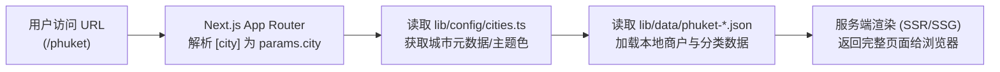

# Global Business & Travel Guide (环球商业与旅游导览)

本项目基于 **Next.js 13+ (App Router)**、**TypeScript** 与 **Tailwind CSS** 构建，采用统一架构承载多城市/多地区（如普吉岛、曼谷、北京、岘港等）的旅游导览与 B2B 商会业务。

---

## 目录与路由架构

```text
app/
├── layout.tsx                # 全局根布局
├── page.tsx                  # 统一入口主页 (/)
├── chamber/
│   └── page.tsx              # 华商联合 B2B 商会门户 (/chamber)
├── merchants/
│   ├── page.tsx              # 商户列表 (/merchants)
│   └── MerchantsPageClient.tsx
├── merchant/
│   └── [id]/                 # 动态商户详情 (/merchant/:id)
│       ├── page.tsx
│       └── MerchantDetailClient.tsx
├── user/
│   └── page.tsx              # 用户中心 (/user)
└── [city]/                   # 🌐 核心动态城市导览路由 (/[city])
    └── page.tsx              # 匹配 /phuket, /bangkok, /beijing 等
```

---

## 核心解析：`[city]` 动态子文件夹是如何工作的？

在 Next.js App Router 中，文件夹命名为 `[city]` 代表这是一个**动态路由段（Dynamic Route Segment）**。

### 1. URL 映射规则
任何没有被同级静态目录（如 `chamber`、`merchants`、`user`）精确匹配的顶层路径，都会进入 `[city]` 文件夹：
- 访问 `http://localhost:3000/phuket` $\rightarrow$ `params.city` 为 `'phuket'`
- 访问 `http://localhost:3000/bangkok` $\rightarrow$ `params.city` 为 `'bangkok'`
- 访问 `http://localhost:3000/beijing` $\rightarrow$ `params.city` 为 `'beijing'`

---

### 2. 参数解析机制与数据绑定流程

整个解析与渲染流程分为 **3 个步骤**：



#### Step 1: 在 `page.tsx` 中获取路由参数
Next.js 会自动将 URL 中的动态段作为 `params` 注入到页面的服务端组件中：

```tsx
// app/[city]/page.tsx (Server Component)
import { notFound } from 'next/navigation';
import { CITIES_CONFIG } from '@/lib/config/cities';
import { getFeaturedBusinesses } from '@/lib/getBusinesses';
import { CitySlug } from '@/lib/types';

interface CityPageProps {
  params: {
    city: string;
  };
}

export default async function CityHomePage({ params }: CityPageProps) {
  const citySlug = params.city as CitySlug;
  const cityConfig = CITIES_CONFIG[citySlug];

  // 1. 如果访问了未配置的城市，直接触发 Next.js 404 页面
  if (!cityConfig) {
    notFound();
  }

  // 2. 根据 citySlug 读取对应城市的数据文件 (如 lib/data/phuket-*.json)
  const featuredBusinesses = await getFeaturedBusinesses(citySlug);

  return (
    <main style={{ '--theme-color': cityConfig.themeColor } as React.CSSProperties}>
      <h1>{cityConfig.nameZh} · {cityConfig.name}</h1>
      <p>{cityConfig.description}</p>
      {/* 渲染该城市的商户和特色分类 */}
    </main>
  );
}
```

#### Step 2: 城市配置关联 (`lib/config/cities.ts`)
通过 `CITIES_CONFIG[citySlug]` 动态加载各城市的个性化配置：
- **名称与语言**：`name` (英文), `nameZh` (中文)
- **视觉风格**：`themeColor`（例如故宫红 `#8B1E1E`、普吉暖金 `#C9A96E`）
- **城市分类与热门区域**：`popularAreas`、`categories`

#### Step 3: 数据源关联 (`lib/getBusinesses.ts`)
数据助手函数会根据城市名称拼接本地 JSON 数据路径：
```typescript
const filePath = path.join(process.cwd(), 'lib', 'data', `${city}-${category}.json`);
```
这样无需为每个城市重复编写页面，只需新增一个 `lib/data/{city}-{category}.json` 数据文件并在 `cities.ts` 中注册即可生效。

---

### 3. 高级能力：静态预生成 (SSG)

为了让所有城市页面的加载速度达到极致并优化 SEO，可通过 `generateStaticParams()` 在构建期预渲染所有城市：

```tsx
// app/[city]/page.tsx
import { CITIES_CONFIG } from '@/lib/config/cities';

export async function generateStaticParams() {
  // 遍历所有已配置的城市 key，生成静态路径
  return Object.keys(CITIES_CONFIG).map((city) => ({
    city: city,
  }));
}
```

---

### 4. 客户端组件中获取 `city`（如需要）

如果在子组件（`'use client'`）中需要读取当前城市，使用 `useParams` Hook：

```tsx
'use client';
import { useParams } from 'next/navigation';

export function CityBadge() {
  const params = useParams();
  const city = params.city; // string
  return <span>当前所在城市: {city}</span>;
}
```

---

## 常用命令

```bash
# 启动开发服务器
pnpm dev

# 项目构建
pnpm build

# 类型检查
pnpm typecheck
```
